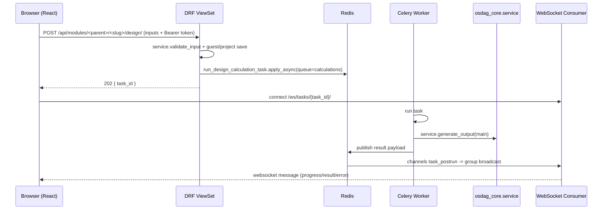
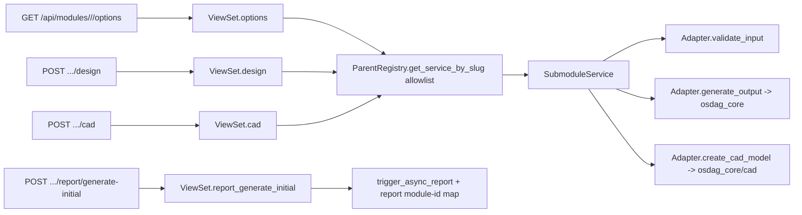

# Osdag-Web Repository Context

> Maintained for AI agents and new contributors. Generated from direct inspection of the repository (branch `master`, remote `https://github.com/captain-07/Osdag-web.git`). Items that could not be verified are marked **UNKNOWN / NOT DETERMINED**.

---

## 1. Executive Summary

Osdag-Web is the web implementation of **Osdag**, an open-source design and detailing software for steel structure connections and members, based on the Indian Standard **IS 800:2007** (Limit State Design). It lets structural engineers run design calculations, generate 3D CAD models, and produce LaTeX-based PDF design reports entirely in the browser.

The system combines:

- **Frontend:** React 19 + Vite 8 + Ant Design (antd 6), Three.js via react-three-fiber for the 3D CAD viewer, Plotly for design charts, Firebase for authentication.
- **Backend:** Django 4.2/DRF served over ASGI (Daphne), Django Channels for WebSocket signaling, Celery + Redis for heavy async tasks.
- **Engine:** A vendored copy of the desktop Osdag core (`osdag_core/`) — calculation code, OpenCASCADE (pythonocc-core) CAD generation, and a TeXLive-based report pipeline.
- **Infra:** Docker Compose (dev + prod), PostgreSQL, Redis, InfluxDB + Grafana for metrics, GitHub Actions CI/CD pushing images to GHCR.

The defining architectural trait is **asynchrony**: design/CAD/report requests are accepted immediately (HTTP 202 + `task_id`), executed by Celery workers on purpose-built queues, and pushed back to the browser over WebSockets (`/ws/tasks/{task_id}/`). A special "optimization mode" (plate girder PSO) streams particle updates live over its own WebSocket.

---

## 2. Project Purpose / Problem Statement

The desktop Osdag distributed calculation results in local files. Engineers lacked a collaborative, accessible, always-available way to run steel connection designs. Osdag-Web solves this by:

- Serving the full Osdag module library (connections, members, base plates) over the web with a modern UI.
- Supporting both **guest (anonymous)** and **registered users**, with project saving for authenticated users.
- Offloading CPU-bound calculations (long-running, memory-heavy pythonocc CAD jobs) to dedicated Celery workers so the web tier stays responsive.
- Generating professional IS 800:2007-compliant design reports as PDFs and exportable CAD model files (`.step`, `.igs`, `.dxf`, etc.).

---

## 3. Repository Structure

```
Osdag-web/
├── context.md                  # This file
├── README.md                   # Project overview + badges
├── REVIEW_PLAN.md              # Code-review scope plan (13 segments, ~69K lines)
├── Dockerfile                  # Backend image (conda env: osdag_env, Python 3.12)
├── docker-compose.yml          # Dev orchestration (db, redis, backend, frontend, worker, monitoring)
├── docker-compose.prod.yml     # Production (queued Celery workers, named volumes, GHCR images)
├── manage.py                   # Django entrypoint
├── requirements.txt            # Backend pip deps
├── populate_database.py        # Loads catalog ASQL (postgres_Intg_osdag.sql) into Postgres
├── osdagweb.sh                 # Helper launch script
├── .env                        # Local env vars (names only; values not committed-secrets)
├── .github/workflows/
│   ├── ci.yml                  # Build/lint on push
│   └── cd.yml                  # Deploy images to GHCR (branch-filtered)
├── backend/
│   ├── config/                 # settings, urls, asgi, wsgi, celery, secret_key, mailing, utils
│   ├── manage.py
│   ├── conftest.py             # pytest: skips ALL backend tests when CI=true
│   └── apps/
│       ├── core/               # Shared core: models, registry, tasks, consumers, auth, APIs
│       ├── modules/            # 7 parent module apps + submodules (registry/service/adapter)
│       └── sections/           # Catalog sections + user custom sections (import/export)
├── frontend/
│   ├── package.json            # React 19, antd 6, vite 8, react-router 8, three/r3f, firebase
│   ├── vite.config.js          # Dev proxy /api,/ws -> backend:8000
│   ├── nginx.conf              # Prod reverse proxy (/api,/ws,/admin -> backend)
│   ├── Dockerfile / Dockerfile.prod   # Node dev / Node build + nginx prod
│   ├── eslint.config.js        # ESLint 10 flat config
│   ├── .nvmrc                  # Node 22
│   └── src/
│       ├── App.jsx             # RouterProvider, lazy-loaded module routes
│       ├── api.js              # Legacy API client (superseded by utils/apiClient.js)
│       ├── Auth/               # firebase.js config; LoginPage; EmailVerificationStatus
│       ├── constants/          # apiRoutes, DesignKeys, moduleIds, moduleNames, moduleRoutes, modules, shortcuts, UIStrings, Urls
│       ├── context/            # AuthContext, GlobalState, ModuleReducer, ModuleState
│       ├── datasources/        # auth, catalog, endpoints, modules, osi, projects, reports, sections
│       ├── homepage/           # Landing + catalog screens
│       ├── modules/            # Per-module UI + shared EngineeringModule shell + hooks
│       └── utils/              # apiClient (Firebase-token HTTP client), auth, csvUtils, shortcuts
├── osdag_core/                 # Vendored desktop engine (calculation + CAD + report)
│   ├── cli.py                  # run_module entry, op_type print_result/save_csv/generate_report
│   ├── Common.py               # Dotted input-key namespaces (Bolt.Diameter, ...)
│   ├── custom_logger.py
│   ├── design_type/main.py     # Main base class (monkey-patched by WebMainRegistry)
│   ├── data/                   # Design types, report data, resource files
│   ├── cad/                    # CAD builders per connection/member
│   └── data/ResourceFiles/Database/postgres_Intg_osdag.sql  # Catalog seed data
├── documentation/              # chapters 1–13 + INDEX.md (architecture write-ups)
├── claude/                     # 00 cross-cutting summary + 01–13 code-review reports
├── gemini/                     # Gemini-generated analysis files (older)
├── load_tests/                 # Locust load tests (incl. WebSocket + plate-girder PSO)
├── monitoring/                 # metrics_collector.py, InfluxDB + Grafana provisioning
├── file_storage/               # Runtime: osi files / user exports / cad_models (git-ignored)
└── logs/
```

---

## 4. Architecture / System Overview

```mermaid
flowchart TB
    subgraph Client
        FE[React SPA :5173 / nginx]
        VIEW[3D Viewer - three-r3f]
    end

    subgraph Backend Tier
        ASGI[Daphne ASGI server :8000]
        WS[Channels /ws/tasks/{id}, /ws/optimize/plate-girder]
        REST[DRF viewsets + APIs]
    end

    subgraph Data Tier
        PG[(PostgreSQL 14)]
        REDIS[(Redis: broker + channel layer + cache)]
        META[(InfluxDB metrics)]
    end

    subgraph Workers
        W1[Celery: calculations q - concurrency 18]
        W2[Celery: cad q - concurrency 8, max-tasks-per-child 10]
        W3[Celery: reports q - concurrency 4]
        BEAT[Celery Beat: daily cleanup]
    end

    subgraph Engine
        ENG[osdag_core - servers, connectors, reports, CAD]
    end

    FE -->|Firebase Auth / tokens| REST
    FE -->|HTTP 202 + task_id| REST
    REST -->|enqueue| REDIS
    REDIS --> W1 & W2 & W3
    W1 & W2 & W3 --> ENG
    ENG -->|results| REDIS
    WS -->|task status stream| FE
    W1 & W2 & W3 -->|task_postrun signal| WS
    REST --> PG
    ASGI --> META
```

**Request lifecycle (design task):**



---

## 5. Technology Stack

| Layer | Tech | Notes |
|---|---|---|
| Language | Python 3.12 (conda env `osdag_env`), Node 22 (frontend) | CI uses Python 3.11 |
| Backend framework | Django (django 4.x), Django REST Framework, Django Channels 4 | ASGI via Daphne |
| Async | Celery 5.x + Redis broker/result backend | Celery Beat for `clean_temporary_files` daily |
| Database | PostgreSQL (psycopg2), ArrayField etc.; catalog seed via ASQL | dev db port 5433:5432 |
| Cache | django-redis (optional, toggle `USE_REDIS_CACHE=true`) | prod uses it |
| Frontend | React 19, Vite 8, antd 6, react-router 8 (lazy routes) | |
| 3D viewer | Three.js 0.186, @react-three/fiber 9, drei | `.obj` models from backend |
| Charts | plotly.js-dist-min + react-plotly.js | force-vs-strain curves |
| Auth | Firebase Auth (email/password + Google SSO) | backend verifies Firebase ID tokens via PyJWT |
| CAD engine | pythonocc-core (conda), CairoSVG, svgwrite | OpenCASCADE geometry |
| Reports | TeXLive (`osdag_latex_env`), pdfkit/wkhtmltopdf, matplotlib, PyLaTeX, XlsxWriter | |
| Monitoring | InfluxDB + Grafana + silk profiler | metrics middleware |
| Deploy | Docker Compose, GHCR images, nginx, cloudflared tunnel support | |

`backend/config/settings.py` details used by later sections: `CELERY_TASK_ROUTES` maps the three operations to queues `calculations` / `cad` / `reports`; `CELERY_DEFAULT_QUEUE = 'calculations'`; `CELERY_TASK_ALWAYS_EAGER` is set when running under `pytest` (so tests run tasks synchronously — except CI skips them entirely).

---

## 6. Backend Architecture

`backend/config/urls.py` mounts four top-level includes:

- `'' → apps/core.urls` (auth, tasks, projects, osifiles, design/report, CAD, optimize, custom-materials, internal, health)
- `'api/sections/' → apps.sections.urls`
- `'api/modules/' → apps.modules.urls` (aggregates all 7 module apps)
- `'silk/' → silk.urls` (profiler; ungated)
- static file serving, plus `OSIFILES_URL` in DEBUG.

### apps.core (the "core" Django app)
- **Models** (`apps/core/models.py`): `Project`, `OsiFile`, `UserAccount`, `CustomMaterials` + catalog models (`Beams`, `Columns`, `Angles`, `Channels`, `RHS`, `SHS`, `CHS`, `Bolt`, `Material`, ...).
- **Registry pattern** (`registry.py`): `BaseModuleRegistry` with `_global_registry`, `auto_discover`, `register`, `get_service_by_slug`, `get_service_by_slug_or_404(slug, allowlist)`. Parent registries (e.g. `ShearConnectionRegistry`) subclass it. The `get_service_by_slug_or_404` variant enforces an **allowlist** derived from each parent's supported slug map.
- **main_registry.py + signals**: `WebMainRegistry` tracks `Main` instances per thread; `apps.core/apps.py::ready()` monkey-patches `osdag_core.design_type.main.Main.__init__` to record instances used during a task.
- **module_finder.py**: `module_dict` / `developed_modules` — single source consumed by the `/api/modules/` (GetModules) endpoint; falls back to legacy `osdag_api` when needed.
- **tasks.py / consumers.py / routing.py**: the async pipeline (see §13).
- **permissions.py**: `IsEmailVerified`, `IsSenderOrReadOnly`(names per file; grep to confirm exact class list).
- **middleware/firebase_auth.py**: `FirebaseAuthentication` DRF backend — verifies Firebase ID token, caches `firebase_token:{sha256}` in Django cache, sets `request.user` (or an AnonymousUser with auth error).
- **middleware/metrics_middleware.py**: records request metrics to InfluxDB.
- **apps/core/api/**: sub-packages `auth/`, `cad/`, `design/`, `modules/`, `projects/` (e.g. `project_api.py`, `cad_model_download.py`, `report_customization_api.py`, `jwt_api.py`, `google_sso_api.py`).
- **utils/module_helpers.py**: `handle_design_request`, `trigger_async_design`, `trigger_async_cad`, `trigger_async_report` — shared orchestration; **utils/cad_helpers.py**: `generate_cad_models`, `get_default_sections`.

### apps.sections
User-defined section management: models `UserCustomBeam/Column/Angle/Channel`; views for list/upload/export; `validation.py` (IS 800 geometry validation), `options_merge.py` (`merge_user_sections_into_options`), `export_scopes.py`.

### apps.modules (parent module apps)
`base_plate`, `compression_member`, `moment_connection`, `flexure_member`, `shear_connection`, `simple_connection`, `tension_member`. Each parent has `apps.py` (auto-discovery of registry), `urls.py`, `views.py` (a ViewSet routing by URL slug), `registry.py`, `shared.py` (shared helpers/Engine classes), and `submodules/<name>/{adapter.py, service.py}`.

---

## 7. Frontend Architecture

- **Entry** (`src/main.jsx`): React root + `RouterProvider`; providers `AuthProvider`, `GlobalProvider`, `ModuleProvider`, `ShortcutProvider`; design module routes are **lazy-loaded**.
- **Routing** (`src/App.jsx` + `src/constants/moduleRoutes.js`): each design module has a route; share a common shell.
- **Module shell** (`src/modules/shared/components/EngineeringModule.jsx`): the orchestrator. Composes hooks:
  - `useEngineeringService` (API layer via `src/datasources/modulesDataSource.js` + `endpoints.js`)
  - `useModuleData`, `useDesignSubmission`, `useModuleForm`, `useDependentData`, `useDesignPrefSync` (localStorage prefill), `useNavigationGuard` (unsaved-input lock), `useDesignReport`.
  - Submits via `handleSubmitEnhanced` (EngineeringModule.jsx:400); PSO modes call `startPsoOptimization`, otherwise `actions.handleSubmit`.
- **Newer parallel refactor path**: `context/EngineeringContext.jsx` + `EngineeringLayout.jsx` + `EngineeringHeader.jsx` exist alongside the hook-based shell (documented in `documentation/chapter_8`; review notes that context is not memoized — the hook-based path is the live one).
- **HTTP client** (`utils/apiClient.js`): reads Firebase auth token (`getIdToken`), sends `Authorization: Bearer`, auto-refreshes once on 401. `src/api.js` and `src/modules/shared/api/moduleApi.js` are legacy (kept for back-compat).
- **API routes** (`src/constants/apiRoutes.js`): `MODULE_SLUGS` maps design keys → backend slugs. Note `END_PLATE` → `'shear-connection/header-plate'` (the header-plate adapter computes both). Compression member keys map to `compression-member/<underscore_slug>`; the backend `_normalize_slug` converts `_` → `-` plus legacy aliases (`Struts-Bolted-Design`, `Compression-Member-Design`).
- **3D viewer**: `src/modules/shared/components/CadViewer.jsx` / `CadScene.jsx` load `.obj` models returned by CAD endpoints or shipped for common cases in `frontend/public/output-<section>.obj`.
- **Auth UI**: `src/Auth/LoginPage.jsx`, `EmailVerificationStatus.jsx`, `src/Auth/firebase.js` (Firebase web SDK config — publicly-known app identifiers; treat as non-secret but never copy into code you commit).

---

## 8. osdag_core Engine Integration

- `osdag_core/cli.py::run_module(module, op_type, input_path, ...)` — `op_type` ∈ `print_result | save_csv | generate_report`; input is an **OSI** YAML file; output path must be inside the invoking user's home directory (engine constraint).
- `osdag_core/design_type/main.py`: each design type subclasses `Main` with `compute()`, section finders, and CAD/`create_report_...` methods. `apps.core.WebMainRegistry` records instances (monkey-patch in `apps/core/apps.py`), so web tasks can retrieve the `Main` used for a deterministic report.
- `osdag_core/Common.py`: dotted, capitalised input keys (`'Bolt.Diameter'`, `'Anchor Bolt.Diameter'`, ...) used by engines; module **adapters** marshal the snake_case web JSON into these dotted keys.
- `custom_logger.py`: engine logging redirected into task log buffers that stream to the browser via WebSocket.
- CAD: `osdag_core/cad/` builds parts via pythonocc; adapters expose `create_cad_model(main, ...)` and per-section `create_from_input(main, section, ...)` for hover dicts.
- Seed catalog: `populate_database.py` loads `osdag_core/data/ResourceFiles/Database/postgres_Intg_osdag.sql`.

---

## 9. Module & Submodule System (Registry / Service / Adapter)



Parent `views.py` is a generic ViewSet; the **non-captured URL slug** selects the service:

- `design`/`cad`: resolve `ServiceClass = ParentRegistry.get_service_by_slug_or_404(slug, ALLOWED_SLUGS)`.
- `report/generate-initial`: `trigger_async_report(parent, slug, REPORT_MODULE_ID_MAP, request)` — slug → legacy `module_id` (e.g. `Beam-to-Beam-End-Plate-Connection`, `Struts-Bolted-Design`).
- `options`: builds dropdown lists from catalog models **per slug** (materials incl. `CustomMaterials` + `{id:-1, Grade:"Custom"}`, bolt diameters, thickness lists, section profiles, design-method/end-condition/link lists) then passes through `merge_user_sections_into_options`.
- Parent allowlists: `SHEAR_CONNECTION_ALLOWED_SLUGS`, `MOMENT_CONNECTION_ALLOWED_SLUGS`, `COMPRESSION_MEMBER_ALLOWED_SLUGS`, etc.

### Current submodule inventory (verified)

- **shear_connection**: `cleat_angle`, `fin_plate`, `header_plate`, `seated_angle`
- **moment_connection**: `beam_beam_cover_plate_bolted`, `beam_beam_cover_plate_welded`, `beam_beam_end_plate`, `beam_column_end_plate`, `column_column_cover_plate_bolted`, `column_column_cover_plate_welded`, `column_column_end_plate`
- **tension_member**: (see `registry.py`; incl. angle/plate systems) — verify exact list in `backend/apps/modules/tension_member/registry.py`
- **compression_member**: `struts_bolted`, `struts_welded`, `axially_loaded_column`
- **flexure_member**: beams + `on_cantilever`, `plate_girder` (+ PSO), shear/moment connectors — verify exact list in registry
- **base_plate**: single module
- **simple_connection**: single module

> Note: items like the `engineering_module` ORM class, `module_id` (e.g. `Beam-Beam-End-Plate-Connection`), and the `develop/in-progress` flags of GetModules are computed at runtime by `module_finder.py` from the registry (`developed_modules`). Exact dynamic values are **UNKNOWN / NOT DETERMINED** without a running instance.

Adding new modules is documented in `documentation/general/ADDING_MODULES_AND_SUBMODULES_BACKEND.md`; `frontend/src/components/ModuleCard` / `homepage` list modules from `GetModules`.

---

## 10. Authentication & Authorization

- **Client side:** Firebase Auth (`src/Auth/firebase.js`) — email/password + Google SSO; token obtained via `getIdToken()`.
- **Backend:** Django users are created/linked to Firebase UIDs (see `apps/core/api/auth/*`, `backend/apps/core/middleware/firebase_auth.py`). `FirebaseAuthentication` verifies the JWT (PyJWT), caches per-token verification, and only acts on authenticated users; DRF `DEFAULT_AUTHENTICATION_CLASSES` includes it.
- **Permissions:** `IsEmailVerified` gates email-not-verified users (feature gating/soft usage). Guests flow through `AllowAny` endpoints with guest mode (no persistence).
- **Project save:** authenticated users save under `request.user`; guests may use a transient project budget (project saving disabled server-side unless a contract is designed — see `module_helpers`).
- **Behavioral quirks worth noting:**
  - `POST /api/auth/jwt/home` and `POST /api/auth/googlesso` are documented as affected by a `set` vs `dict` typo causing HTTP 500 (REVIEW_PLAN context) — verify current source before relying on them.
  - Email verification status is surfaced to the frontend to gate design/report actions.
- **CSRF:** immutable GETs + Bearer-based auth; DRF viewsets are otherwise token-driven.

---

## 11. API Inventory

> Paths below were verified from `urls.py` includes; exact sub-paths are summarized. **UNKNOWN / NOT DETERMINED** where a detail wasn't re-verified.

### Core (`apps/core/urls.py` + api sub-packages)
- `GET .../api/modules/` (`apps/core/api/modules/modules_api.py`, `GetModules`) — json of all modules.
- `POST .../api/tasks/<task_id>/` (`TaskStatusAPIView`, AllowAny) — poll task status/result.
- Projects: `.../api/projects/` list/create, `.../api/projects/<id>/` retrieve/delete, save inputs/outputs, osifiles, reports (see `apps/core/api/projects/project_api.py`).
- OSI files: upload/download/inspect (`.../api/osifiles/`, OSIFILES_ROOT via FileSystemStorage; served in DEBUG).
- CAD: `.../api/cad/generate/`, `.../api/cad/model/download/` (`apps/core/api/cad/cad_model_download.py`), CAD captures, `.../api/images/capture/`.
- Design/report: `.../api/design/...`, report customization initial generation (`generate_initial_report_core`), report files download.
- Auth: `.../api/auth/register`, `.../api/auth/verify-email`, `.../api/auth/googlesso`, `.../api/auth/jwt/home`, token refresh, re-send verification (`apps/core/api/auth/`).
- Optimize: `.../api/optimize/plate-girder/` (PSO control endpoints).
- `.../api/custom-materials/`, `.../api/internal/`, `.../api/health/`.
- Admin, silk: `/admin/`, `/silk/`.
- WebSockets: `/ws/tasks/<task_id>/`, `/ws/optimize/plate-girder/`.

### Modules (`apps/modules/*/urls.py`)
Each parent exposes a `/api/modules/<parent>/` ViewSet with:
- `GET  <parent>/<slug>/options/`
- `POST <parent>/<slug>/design/`        → 202 + `{task_id}` (async)
- `POST <parent>/<slug>/cad/`           → (moment/shear async via `trigger_async_cad`; compression-member's `cad` action is **synchronous** `generate_cad_models` in `views.py`)
- `POST <parent>/<slug>/report/generate-initial/`

### Sections (`apps/sections/urls.py`)
- User custom sections CRUD for Beams/Columns/Angles/Channels; validation; export tools (`export_scopes.py`), options merging endpoint(s).

---

## 12. Database Schema & Models

### Managed Django models
- `apps.core`: `Project`, `OsiFile`, `UserAccount` (incl. `deletion_requested_at`), `CustomMaterials`, catalog read models (`Beams`, `Columns`, `Angles`, `Channels`, `RHS`, `SHS`, `CHS`, `Bolt`, `Material`). Some models use Postgres `ArrayField`; migrations range up to hundreds of numbered files in `apps/core/migrations/`.
- `apps.sections`: `UserCustomBeam`, `UserCustomColumn`, `UserCustomAngle`, `UserCustomChannel` (+ their through/settings tables).

### Catalog (seeded, not managed)
`populate_database.py` + `osdag_core/data/ResourceFiles/Database/postgres_Intg_osdag.sql` populate the design catalog (sections, grades, bolts, materials, databases). Column names are engine-style capitalised (e.g. `Bolt_diameter`, `Designation`); reserved-word column names are quoted in the DDL (e.g. `"Group"` on the Bolt model workaround).

### Key usage
- `Project.inputs_json` / `outputs_json` hold full engine I/O for saved designs.
- Engine dynamic `Main` objects are **not** persisted; only outputs + report artifacts are stored (cad files → `file_storage/`, osi files → `OSIFILES_ROOT`, exports in DEBUG static).
- GeoDB or spatial fields: **UNKNOWN / NOT DETERMINED** (not observed).

---

## 13. Async Processing & WebSockets

- **Trigger:** `trigger_async_design/cad/report` (`apps/core/utils/module_helpers.py`) build a serializable payload, save into Redis/local via `task_registry`?? (Redis-backed intermediate store — verify exact store in `tasks.py`), enqueue via `apply_async`.
- **Queues** (via `CELERY_TASK_ROUTES`/prod compose): `calculations` (concurrency 18), `cad` (8, `--max-tasks-per-child=10` to curb pythonocc memory leaks), `reports` (4), plus `celery_beat` (daily `clean_temporary_files(24h)`).
- **Results:** `apps.core.signals` listens to Celery `task_postrun`, serializes output, publishes to the Channels group for the task id; `consumers.py` (`TaskStatusConsumer`) broadcasts `progress`, `result`, or `error` messages to `/ws/tasks/{task_id}/`.
- **Guest + project save:** synchronous request-side work (`handle_design_request`) persists Project rows for authenticated users before enqueueing.
- **PSO optimization (plate girder):** `run_pso_optimization` in `apps/modules/flexure_member/submodules/plate_girder/tasks.py`, auto-registered for Celery via `celery.py` `extra_modules`. Streams particle batches (~12 FPS; `MAX_PARTICLES_PER_BATCH=50`, `HEARTBEAT_INTERVAL=2.0s`) over `/ws/optimize/plate-girder/`; mitigates client-side DOM flood + noise reduction.
- **Failure modes:** tasks surface errors as WS `error` and via task status; `CELERY_RESULT_EXPIRES=1800`.

---

## 14. CAD Pipeline

1. POST `cad` with `inputs` + optional `sections` (default sections from `get_default_sections(parent, slug)`).
2. ViewSet resolves service; calls `generate_cad_models(service_class=..., inputs=..., sections=..., create_from_input_func=...)` (sync path in `compression_member`) or `trigger_async_cad` (moment/shear/etc.).
3. Engine (`osdag_core/cad/`) builds parts per section → exports files (`.step`, `.igs`, `.dxf`, etc.) under `file_storage/cad_models/{request_id}_{section}.{fmt}` and returns `{files, hover_dict, warnings}`.
4. Frontend `CadViewer` renders `.obj` (browser-consumable) models, plus CAD capture images (iso/front/side/top) feeding report image slots.
- Common `.obj` models shipped in `frontend/public/output-<section>.obj` for quick previews.

---

## 15. Report Generation (LaTeX)

- `POST <parent>/<slug>/report/generate-initial/` → `trigger_async_report` (parent `REPORT_MODULE_ID_MAP` slug → engine `module_id`) or `get_report_module_id`/`generate_initial_report_core` for modules without report mapping (e.g. compression) — engine class maps slug → module id (see `apps/core/constants.py`).
- Request shape: `{metadata, input_values|inputs, design_status, logs, sections?, customization?, images?}`.
- Worker (`run_report_generation_task`) runs TeX (`osdag_latex_env` conda env) → PDF; logs stream to WS; PDF downloadable via `/api/design/...`/projects/report endpoints.
- Report images from CAD captures inserted via `customization/images` (see `apps/core/utils/tests/test_report_image_generator.py` and `apps/core/api/design/tests/test_design_report_with_images.py`).

---

## 16. Security

> Items below are verified findings; plenty of hardening already exists (token caching, allowlists, guest budget). Known gaps/notables to be aware of:

- **Ungated admin/silk:** `/admin/` and `/silk/` are mounted without bespoke access control (standard Django admin auth for admin; silk has no authz) — flag in any security review.
- **Task visibility:** `TaskStatusAPIView` is `AllowAny` (documented in `documentation/chapter_1`); task ids are UUID4 (unguessable-ish, but outputs are fully public if leaked).
- **CAD download path:** `apps/core/api/cad/cad_model_download.py`: `file_path = os.path.join("file_storage", "cad_models", f"{request_id}_{section}.{format_type.lower()}")` with `request_id`/`section` interpolated from the request (no strict allowlist on `section`; potential path-traversal surface — sanitize/re-verify before hardening). No explicit permission class gating.
- **Firebase config** is client-embedded (public web app identifiers by design); server secrets must never be added there.
- **`.env` locals:** `SECRET_KEY`, DB creds, `SMTP_PASSWORD`, `INFLUXDB_TOKEN` are env-driven (`config/utils.py` reads `SMTP_PASSWORD` env; `settings.py` reads `SECRET_KEY`, DB vars). Keep out of git.
- **CI test skip:** `backend/conftest.py` marks all tests skip when `CI=true` — tests currently only run locally; treat CI as build+lint only.

---

## 17. Deployment & Docker

- **Root `Dockerfile`** (backend image): `miniconda3` base → conda env `osdag_env` (Python 3.12) with `pythonocc-core`, `cairo`, `osdag_latex_env`; installs `requirements.txt` (+ apt `wkhtmltopdf`); runtime user `deployuser:8888`; entrypoint composes gunicorn → uvicorn workers (`config.asgi:application`, 4 workers, timeout 60) on port 8000.
- **`docker-compose.yml` (dev):** `db` (postgres:14-alpine, host port 5433), `redis` (7-alpine), `backend` (build ., `platform linux/amd64`, volume `.:/app`, env `DATABASE_HOST=db`, `REDIS_URL`, `CELERY_BROKER_URL`, `INFLUXDB_URL`...), `frontend` (node dev server :5173), plus worker + monitoring services.
- **`docker-compose.prod.yml`:** images `ghcr.io/captain-07/osdag-web/backend:latest` (author referenced as sogalabhi in badges — confirm current image name); `DEBUG=False`, `USE_REDIS_CACHE=true`; queues `calculations`/`cad`/`reports` workers and `beat` as above; named volumes `static_volume`, `media_volume`, `osifiles_volume`, `file_storage_volume`; `celery_beat` service; monitoring stack.
- **`frontend/Dockerfile.prod`:** `node:22-alpine` build → `nginx:alpine`; `nginx.conf` proxies `/api`, `/ws`, `/admin` → `backend:8000`; static SPA served by nginx.
- **`osdagweb.sh`:** convenience runner script (full contents not read — reference for local ops).
- **Networking:** Vite dev proxy `VITE_PROXY_BACKEND_URL` (default `http://127.0.0.1:8000`) for `/api` + `/ws`; cloudflared tunnel support added for external access.

---

## 18. Configuration & Environment Variables

Core vars (names verified from `.env` and settings):
`DEBUG`, `SECRET_KEY`, `ALLOWED_HOSTS`, `DATABASE_NAME/USER/PASSWORD/PORT`, `DATABASE_HOST`, `REDIS_URL`, `CELERY_BROKER_URL`, `CELERY_RESULT_BACKEND`, `REDIS_CACHE_URL`, `USE_REDIS_CACHE`, `CELERY_TIMEZONE`, `SMTP_PASSWORD`/`FROM_EMAIL` (mailing), `INFLUXDB_URL`/`INFLUXDB_TOKEN`/`INFLUXDB_ORG`/`INFLUXDB_BUCKET` (metrics), `VITE_API_URL`, `VITE_PROXY_BACKEND_URL`, `FIREBASE_*` project config. `config/secret_key.py` + `secret/` root used for key persistence on local boot (see `SECRET_ROOT`).

---

## 19. CI/CD Pipeline

- **ci.yml:** triggered on push; builds/lints backend + frontend (ESLint flat config, node 22), seeds/build checks, pushes images. (Exact steps from `.github/workflows/ci.yml` — verify before quoting in PRs.)
- **cd.yml:** branch-filtered deployment path (recent commit `0d9652ac` "CI/CD branch filters" → `25april` branch conditions) pushing to GHCR + remote deploy/`osdagweb.sh` orchestration; cloudflared support added (`5daacc14`).
- Backend tests are intentionally **skipped in CI** (§16); test runs are local-only today.

---

## 20. Testing

- **Backend (pytest, ~1126 lines total):**
  - `apps/core/tests/test_api.py` (API surface), `test_design_pref_sync.py`, `test_email_verification.py`, `test_gdpr_compliance.py` (Gdpr export/delete — feature `0508ebbb`), `test_my_data.py`.
  - `apps/core/utils/tests/test_report_image_generator.py`, `apps/core/api/design/tests/test_design_report_with_images.py`.
  - `conftest.py`: `pytest_collection_modifyitems` skips everything when `CI=true`; `CELERY_TASK_ALWAYS_EAGER` makes tasks run inline under pytest.
- **Frontend:** no unit-test framework configured; linting via ESLint flat config + production build (`npm run build`) are the checks.
- **Load tests:** `load_tests/` Locust suites incl. HTTP design flows, WebSocket task streaming, and plate-girder PSO WS batching (`documentation/chapter_12`).

---

## 21. Key Design Patterns & Architectural Decisions

1. **Registry + auto-discovery (backend):** app `ready()` discovers submodules; slugs select services; allowlists block unsupported slugs (added after code review).
2. **Adapter/Service split:** `service.py` computes; `adapter.py` marshals web JSON → osdag_core dotted keys & back. One engine module serves several web modules (e.g. header-plate adapter doubles as end-plate).
3. **Async-first UX:** HTTP 202 + WS push; deterministic `task_id` correlation; progress streaming from engine logs.
4. **Thread-local Main tracking** (`WebMainRegistry` + `Main.__init__` monkey patch) so report generation can reuse the same engine object deterministically.
5. **Guest → authenticated upgrade path:** inputs preserved during guest designs; save-on-authenticate via `project_id` (see `module_helpers`).
6. **Declarative module config:** `frontend/src/constants/*` (DesignKeys, moduleIds/moduleNames/moduleRoutes/modules.js) drive UI layout; backend `constants.py` mirrors `module_id` mapping for reports.
7. **Parallel refactor:** the frontend intentionally maintains two shells (hooks-based live path + `EngineeringContext.jsx` context refactor). Similarity checks are handled in `src/utils/` — current modules use the hook path.
8. **Metrics-first ops:** per-request middleware → InfluxDB; Grafana dashboards; `monitoring/metrics_collector.py` for task metrics.
9. **GPU-less CAD:** pythonocc CPU rendering + `.obj` export to keep the browser viewer light.
10. **Queue isolation:** dedicated Celery queues mirror three workload classes (calc/cad/report) with tuned concurrency + child-restart to bound memory.

---

## 22. Documentation & Contributing

- **`documentation/`**: `INDEX.md` + chapters 1–13 covering architecture, auth, module systems, frontend state, deployment/conda, load testing, metrics; `general/` install guides (linux/mac/windows — currently modified in the working tree), `ADDING_MODULES_AND_SUBMODULES_BACKEND.md`.
- **`claude/`**: 00 cross-cutting summary + 01–13 segment code-review reports, plus `15-cad-section-naming-audit.md`; `gemini/` holds older analysis.
- **`REVIEW_PLAN.md`**: 13 reviewed segments; several findings were subsequently fixed (e.g. orphaned `cantilever` submodules removed — see git history; allowlist enforcement; log-reversal moved server-side).
- **`README.md`**: badges, local dev setup, quickstart commands.
- Some docs predate recent refactors (e.g. chapter claims about `cantilever` submodules / projects endpoints details) — **prefer code as ground truth**; where reviewing, cross-check with `git log`.

---

## 23. Code Review & Technical Debt

Verified residual items worth handling eventually:

- `silk` and task-status endpoints lack dedicated access control; CAD download path builds filename from request fields without sanitization (`apps/core/api/cad/cad_model_download.py`).
- Frontend has two service paths (legacy `moduleApi.js` / `api.js` vs live `datasources/*`) and two shells (hooks vs `EngineeringContext`) — remove legacy once migration completes.
- Compression-member `cad` action is synchronous while siblings are async — inconsistent UX.
- `EmailVerificationStatus.jsx` / email flows are tightly coupled to Firebase; report/design gating logic in `permissions.py` should be kept as single source of truth.
- `monitoring/metrics_collector.py` reads `INFLUXDB_TOKEN` from env (good); ensure compose/secrets never hardcode it.
- Working tree currently has uncommitted edits to `documentation/general/installation_docs_{linux,mac,windows}.md` only.

---

## 24. Git & Development Workflow

- ~6153 commits (history carries legacy desktop Osdag commits). Recent meaningful milestones (newest-first):
  - dev-tool upgrades: ESLint 10 flat (`9bd42bc2`), Vite 8 (`0469311d`), antd 6 (`b0ad2bd4`), react-router 8 (`c4412cc1`), Node 22 (`0d9652ac`/`cc0b1ee0`), lazy module routes (`0a58be20`), remaining dep updates (`37a9a2ab`).
  - architecture: Firebase auth (`69dbc0af`), async Celery + WS task streaming + beat (`26e03e5c`, `d8aad8c2`), legacy `Design` model removal (`ee131033`), GDPR export/delete (`0508ebbb`), soft-delete removal (`ff5caf6c`), cover-plate config modularization + orphan cleanup (`78c34778`, `e4379a23`), compression-member rename + cantilever import migration (`f9e38083`), CI/CD branch filters (`25april`), Cloudflare tunnel (`5daacc14`).
- Branch: `master` (default), up-to-date with `origin/master`. Commit style: conventional-ish short summaries (`feat:`, `refactor:`, `fix:`, `docs:`).

---

## 25. AI-Agent Guide / Context for Fast Navigation

- **Start reading order:** `backend/apps/core/utils/module_helpers.py` → `backend/apps/core/tasks.py` → one parent module (`shear_connection` is the cleanest) `views.py`+`registry.py`+`submodules/fin_plate/*` → `osdag_core/design_type/main.py` → `frontend/src/modules/shared/components/EngineeringModule.jsx` + `frontend/src/datasources/endpoints.js`.
- **Trace a design request end-to-end:** `EngineeringModule.handleSubmitEnhanced` → `modulesDataSource.submitDesign` → `ViewSet.design` → `trigger_async_design` → `run_design_calculation_task` → `service.generate_output(main)` → `task_postrun` → `consumers.TaskStatusConsumer` → CadViewer.
- **To extend the product:** add a submodule (folder under a parent + `adapter.py`+`service.py`+registry export), then a frontend route/module entry per `constants/*`; follow `ADDING_MODULES_AND_SUBMODULES_BACKEND.md`.
- **Never store credentials in code**; keep engine I/O keys dotted-capitalized; honor the user-home output constraint on `osdag_core` paths; run backend tests locally (they skip in CI) and `npm run lint` + `npm run build` for frontend.
- **Intended architecture source docs:** `documentation/` chapters + `claude/` review reports — but confirm against current code before asserting behavior.

---

## 26. Final Summary

Osdag-Web is a production-grade web port of a desktop steel-design (IS 800:2007) tool. It is cleanly split into a React SPA, an ASGI Django/DRF API, a Celery-backed async worker tier with WebSocket progress push, a Postgres/Redis data tier, and a vendored C++/PythonCAD+LaTeX engine. Its module system is registry/service/adapter based and now enforces allowlists for security; the CAD pipeline targets mobile-friendly `.obj`; reports are full LaTeX PDFs. Deployment is containerized with queue-isolated workers, GHCR CI/CD, and InfluxDB/Grafana telemetry. Known technical debt is concentrated in legacy frontend paths, permission/allowlist hardening around a few endpoints, and the fact that CI runs no backend tests.